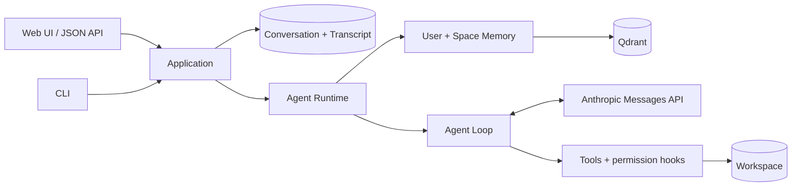

# Mini Code Agent

[中文](README.md) · [Architecture](docs/architecture.en.md) · [Memory and evaluation](docs/memory-and-evaluation.en.md) · [Usage and contribution](docs/usage.en.md)

[](https://github.com/JohnnyYwQ/mini-code-agent/actions/workflows/ci.yml)

[](LICENSE)

A personal engineering project built around a **stateful Coding Agent**: Conversations persist, Memory works
across Turns and Conversations within explicit User/Space Scopes, and model calls, tools, permissions, and
context management meet inside a short-lived Agent Runtime.

Mini Code Agent is neither positioned as a tutorial nor presented as a production-ready Agent. It focuses on
engineering boundaries that can be run, tested, and evaluated: Django Web/CLI, the Anthropic Messages API,
workspace tools, Qdrant Memory, hybrid retrieval, BGE Reranking, and a reproducible LongMemEval Retrieval Baseline.

> **Intended scope:** The current version is for a trusted local, single-User environment. The Agent can run
> shell commands and change workspace files; the Web app, JSON API, and tool layer have neither production
> authentication nor a complete sandbox. Do not expose them directly to the public internet.

## Engineering focus

### Persistent Conversations and scoped Memory

- The Conversation Transcript persists complete user, assistant, and tool protocol messages across processes.
- One Memory Space represents one local workspace and can share Space Memory across several Conversations.
- User Memory is available across every Memory Space owned by the User; Space Memory stays within its target space.
- Every Turn combines E5 dense and BM25 keyword candidates, fuses them with RRF, and reranks them with
  `BAAI/bge-reranker-v2-m3`.
- Recalled Memory is ephemeral Memory Context for the current Turn; it is never disguised as Conversation Transcript.

### Agent Runtime and Agent Loop

- Web and CLI use the same Application boundary to resolve the Conversation, User, Memory Space, and workspace.
- Each Turn creates an Agent Runtime fixed to one workspace and Memory Context; a Conversation is not a resident process.
- The Agent Loop follows the Anthropic Messages API `tool_use` / `tool_result` protocol until a final reply,
  failure, or the round limit.
- Built-in capabilities cover shell, file operations, glob, todo, skills, context compaction, and `remember`,
  with permission hooks around execution.
- Context compaction changes only the working context of later model calls; it never replaces the authoritative Transcript.

### A runnable end-to-end system

- A Django Web UI, CSRF-protected JSON API, and `prompt_toolkit` CLI share the same application and persistence path.
- SQLite stores Conversations; Qdrant stores retrievable Memory through either an embedded database or service URL.
- File tools remain inside the Conversation workspace; the CLI can interactively confirm potentially destructive commands.
- Python 3.13, `uv.lock`, Django tests, Ruff, mypy, coverage, pre-commit, and GitHub Actions provide reproducible checks.

## Technology

| Layer | Current implementation |
| --- | --- |
| Application | Python 3.13, Django 5.2, SQLite |
| Model | Anthropic Python SDK, Messages API |
| Memory | Qdrant, FastEmbed E5, BM25, RRF, FlagEmbedding BGE |
| Entry points | Django templates, vanilla JavaScript, `prompt_toolkit` |
| Agent capabilities | Workspace tools, permission hooks, skills, todo, compaction |
| Engineering checks | uv, Ruff, mypy, coverage, pre-commit, GitHub Actions |

## LongMemEval retrieval result

The pinned CUDA run `20260816-cu124-v1` evaluates this project's E5 + BM25 + RRF + BGE pipeline on the official
cleaned LongMemEval-S data with the official user-only indexing scope, eligibility rules, and `@5`/`@10` formulas.
Of 500 source samples, the protocol excludes 30 Abstention Cases and 51 samples without user-side target evidence,
leaving 419 scored samples.

| Retrieval pipeline | RecallAll@5 | NDCG@5 | RecallAll@10 | NDCG@10 |
| --- | ---: | ---: | ---: | ---: |
| E5 + BM25 + RRF + BGE | **92.60%** | **94.74%** | **97.61%** | **95.69%** |

These numbers measure **retrieval only**. They are not end-to-end LongMemEval QA, an official leaderboard result,
or a general Agent performance claim. The formal baseline, per-question records, and logs have not yet been
recovered into the repository and independently reverified; this page reports recorded results without presenting
the missing artifacts as published evidence.

[See the full pipeline comparison, exclusions, model revisions, CUDA checks, hashes, limits, and reproduction path →](docs/memory-and-evaluation.en.md)

## Architecture at a glance



The critical path of one Turn:

1. Web or CLI selects or creates a Conversation; the Application derives its trusted User, Memory Space,
   and workspace from persisted state.
2. The Application saves the user message, creates an Agent Runtime for this Turn, and recalls in-Scope Memory.
3. The Agent Loop calls the model and approved tools; tools remain inside the Conversation workspace and policy.
4. On success, assistant and tool protocol messages enter the Conversation Transcript as one ordered batch;
   a failure does not persist partial generated output.

[Read the complete architecture, responsibilities, domain objects, and real Turn data flow →](docs/architecture.en.md)

## Quick start

You need Python 3.13+, [uv](https://docs.astral.sh/uv/getting-started/installation/), and access to the Anthropic API
or a compatible endpoint.

> The BGE reranker downloads lazily on the first Memory recall. Reserve several GB of disk space beforehand.

```bash
git clone https://github.com/JohnnyYwQ/mini-code-agent.git
cd mini-code-agent
uv sync --locked
cp .env.example .env
```

Edit `.env`:

```env
MODEL_ID=your_model_id
ANTHROPIC_API_KEY=your_api_key
# ANTHROPIC_BASE_URL=
```

Start the Web app:

```bash
uv run --locked python config/manage.py migrate
uv run --locked python config/manage.py runserver
```

Open `http://127.0.0.1:8000/` and create a Conversation. Or use the CLI:

```bash
uv run --locked python config/cli.py
uv run --locked python config/cli.py --list
uv run --locked python config/cli.py --resume <conversation-uuid>
```

The CLI resolves its workspace from the launch directory; Web and CLI share one non-login local User. See the
[usage and contributor guide](docs/usage.en.md) for every environment variable, other-workspace operation,
the JSON API, Qdrant configuration, and development commands.

## Current boundaries

- Trusted local, single-User use only; there is no login, API token, multi-User isolation, or remote deployment authentication.
- `bash` uses the system shell; its denylist and workspace path checks are not a complete security sandbox.
- Django still uses development settings; embedded Qdrant is for one process, so concurrent entry points need a shared service.
- Model replies are not streamed, and the Web UI does not expose a complete tool-call trace.
- Memory UPDATE/DELETE, Memory Event integration, and automatic index recovery are not complete.
- Moving or renaming a workspace does not migrate its existing Memory Space automatically.

## Documentation

| Guide | Contents |
| --- | --- |
| [Architecture](docs/architecture.en.md) | Web/CLI, Application, Agent Runtime, Agent Loop, tools, persistence, and one Turn |
| [Memory and evaluation](docs/memory-and-evaluation.en.md) | Scope, retrieval pipeline, LongMemEval protocol, full results, evidence status, and CUDA reproduction |
| [Usage and contribution](docs/usage.en.md) | Setup, configuration, Web/CLI, JSON API, safety, Qdrant, tests, and CI |

Every public guide has a structurally and factually matching [Chinese version](README.md).

## Roadmap

- Recover and independently reverify the formal Retrieval Baseline artifacts.
- Complete the Memory lifecycle and index recovery.
- Add streaming responses and tool-call trace visualization.
- Add authentication, isolation, and a stronger tool sandbox if remote or multi-User use becomes a goal.

## Acknowledgements

The early minimal Agent Loop was inspired by
[shareAI-lab/learn-claude-code](https://github.com/shareAI-lab/learn-claude-code).
This repository later evolved independently around persistent Conversations, scoped Memory, retrieval evaluation,
Web/CLI entry points, and engineering checks; it is not a tutorial fork of that project.

## License

[MIT License](LICENSE) © 2026 JohnnyYwQ
