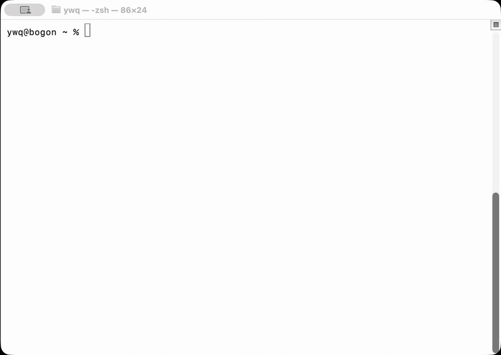

# Mini Code Agent

[中文](README.md)



## Overview

Mini Code Agent 0.2 is a small Django-based coding agent for learning and local development. It provides resumable Web and CLI Conversations, a JSON chat API, workspace-bound Agent Runtimes, and calls the Claude Messages API through the Anthropic Python SDK.

The agent can invoke local tools, observe their results, and continue the conversation until the model returns a final response. The project is intended for trusted local development environments and is not ready for direct public production deployment.

## Features

- Django web chat interface at `/`
- JSON chat endpoint at `/api/chat/`
- Database-backed Conversations with complete top-level tool messages
- A Web sidebar grouped by workspace with cross-workspace resume
- CLI creation by default plus list/resume within the launch workspace
- One shared, non-login Django local User for Web and CLI
- User/Space Memory with automatic hybrid retrieval, BGE reranking, and a no-argument `remember` tool
- Anthropic Messages API agent loop using `tool_use` and `tool_result`
- Local tools:
  - `bash`: run shell commands in the workspace
  - `read_file`: read files inside the workspace
  - `write_file`: write files inside the workspace
  - `edit_file`: replace selected text in workspace files
  - `glob`: find files with glob patterns
  - `todo`: maintain an in-memory task list
  - `load_skill`: load a skill by name
  - `compact`: compact earlier conversation history
- Skill discovery from `SKILL.md` files in first-level subdirectories of `.skills/`
- Context compaction, tool-result trimming, and pre-compaction transcript snapshots
- Hooks around user prompts, tool calls, and agent termination
- Workspace path restrictions for file tools
- Web and CLI entry points
- A Django test suite plus Ruff, mypy, coverage, and pre-commit checks

## Tech Stack

- Python 3.13+
- Django 5.2
- Anthropic Python SDK
- Qdrant, FastEmbed, and FlagEmbedding
- uv
- python-dotenv
- prompt_toolkit
- PyYAML
- HTML, CSS, and vanilla JavaScript

## Project Structure

```text
.
├── .env.example
├── .github/
│   └── workflows/
│       └── ci.yml
├── .pre-commit-config.yaml
├── .skills/
│   └── code-review/
│       └── SKILL.md
├── LICENSE
├── pyproject.toml
├── uv.lock
└── config/
    ├── manage.py
    ├── config/
    │   ├── settings.py
    │   ├── urls.py
    │   ├── asgi.py
    │   └── wsgi.py
    ├── chat/
    │   ├── application.py
    │   ├── composition.py
    │   ├── models.py
    │   ├── tests/
    │   ├── templates/chat/index.html
    │   ├── static/chat/
    │   ├── urls.py
    │   └── views.py
    ├── core/
        ├── agent.py
        ├── agent_runtime.py
        ├── compaction.py
        ├── memory/
        ├── frontmatter.py
        ├── skills.py
        └── todo.py
    └── evals/
        └── memory_retrieval/
```

Key files:

- `config/core/agent.py`: tool definitions, hooks, and the CLI entry point
- `config/core/agent_runtime.py`: Conversation-workspace agent loop, Memory recall, and the `remember` tool
- `config/core/memory/`: Memory extraction, hybrid retrieval, Qdrant adapter, and production composition
- `config/evals/memory_retrieval/`: built-in retrieval cases, the LongMemEval adapter, dataset download, and evaluation entry point
- `config/chat/application.py`: trusted User, Memory Space, Conversation, transcript, and Turn orchestration
- `config/chat/composition.py`: shared Web/CLI Agent Runtime and Memory composition
- `config/core/compaction.py`: transcript snapshots, tool-result trimming, and context compaction
- `config/core/frontmatter.py`: YAML frontmatter parsing for `SKILL.md`
- `config/core/skills.py`: skill discovery, registration, and loading
- `config/core/todo.py`: todo validation and state management
- `config/chat/views.py`: the web view and `/api/chat/` JSON endpoint
- `config/chat/tests/`: unit and behavior tests
- `pyproject.toml`: project dependencies and Ruff, mypy, and coverage configuration
- `uv.lock`: the exact dependency lockfile generated by uv
- `.github/workflows/ci.yml`: quality checks triggered by pushes, pull requests, or manual runs

`pyproject.toml` declares the project dependencies, while `uv.lock` locks exact versions across the complete resolved dependency graph. Together, they are the project's sole dependency-management entry points.

## How It Works

1. Web or CLI selects/creates a Conversation; the application derives its trusted local User, Memory Space, and workspace.
2. The user message is persisted before the agent runs and remains unanswered if the run fails.
3. Each Turn performs hybrid retrieval over User Memory and current Space Memory, reranks with `BAAI/bge-reranker-v2-m3` by default, and injects at most five results into ephemeral system context.
4. A Conversation-bound Agent Runtime runs files, shell, skills, todo, and compaction in the selected workspace.
5. The model may call the no-argument `remember` tool over visible text from up to five completed Turns plus the current Turn.
6. After success, generated assistant/tool-result messages are persisted as one ordered batch; partial generated transcripts are discarded on failure.
7. Web and CLI reload Conversations from the database, so process restarts preserve history.

## Quick Start

Install [uv](https://docs.astral.sh/uv/getting-started/installation/), then sync the locked dependencies from the project root:

```bash
uv sync --locked
```

uv creates or updates `.venv` in the project root. You normally do not need to activate it manually because the remaining commands use `uv run`.

The BGE reranker is loaded lazily. Its model is downloaded on the first Memory recall or BGE evaluation, so reserve several GB of disk space; later runs reuse the local cache.

Create a local environment file:

```bash
cp .env.example .env
```

Edit `.env`:

```env
MODEL_ID=your_model_id
ANTHROPIC_API_KEY=your_api_key
# ANTHROPIC_BASE_URL=
# MEMORY_QDRANT_LOCATION=/absolute/path/to/qdrant
```

Create the database tables:

```bash
uv run python config/manage.py migrate
```

Run Django:

```bash
uv run python config/manage.py runserver
```

Open the web interface:

```text
http://127.0.0.1:8000/
```

Run the CLI:

```bash
uv run python config/core/agent.py
```

The CLI creates a new Conversation by default. List or resume Conversations from the current workspace with:

```bash
uv run python config/core/agent.py --list
uv run python config/core/agent.py --resume <conversation-uuid>
```

Exit the CLI with `q`, `exit`, an empty line, `Ctrl-C`, or EOF.

To operate on another directory while still using this project's environment, run the CLI from the target workspace:

```bash
cd /path/to/workspace
uv run --project /path/to/mini-code-agent \
  python /path/to/mini-code-agent/config/core/agent.py
```

The Conversation and Memory Space bind to the current workspace where the command runs, while dependencies still come from the `mini-code-agent` project.

## Memory Retrieval Evaluation

Evaluations use an isolated in-memory Qdrant instance and never read or write persisted application Memory. Run the 10 built-in cases without reranking as a hybrid-retrieval baseline:

```bash
uv run --locked python config/evals/memory_retrieval/run.py
```

Compare no reranking with the default BGE reranker over the same index:

```bash
uv run --locked python config/evals/memory_retrieval/run.py \
  --reranker none \
  --reranker bge
```

FlashRank is an optional dependency and defaults to `ms-marco-MultiBERT-L-12`:

```bash
uv run --locked --extra flashrank \
  python config/evals/memory_retrieval/run.py \
  --reranker flashrank
```

Download the project's pinned, SHA-256-verified LongMemEval-S dataset, then start with 10 cases:

```bash
uv run --locked python \
  config/evals/memory_retrieval/download_longmemeval.py

uv run --locked python config/evals/memory_retrieval/run.py \
  --longmemeval config/evals/memory_retrieval/data/longmemeval_s_cleaned.json \
  --max-cases 10 \
  --reranker none \
  --reranker bge
```

Remove `--max-cases 10` to run every scored case. The download is about 265 MiB and is stored under the Git-ignored `config/evals/memory_retrieval/data/` directory. Interactive terminals show indexing and per-case progress; CI and redirected output omit the progress bars.

The built-in report includes Hit@1, Recall@5, MRR@5, and ScopeLeak. LongMemEval also reports session-level retrieval metrics.

The pinned Ubuntu 20.04 / RTX 2070 SUPER host has a separate CUDA baseline entry point. It first runs a deterministic smoke that covers all six scored question types, one assistant-only exclusion, and one abstention exclusion, then runs every eligible case. E5/BM25/RRF candidate generation and BGE reranking run in separate processes:

```bash
export MINI_CODE_AGENT_PROXY_URL=http://127.0.0.1:7890  # match the reverse tunnel's local port
./scripts/run_longmemeval_cu124.sh
```

The runner reuses `~/.local/share/mini-code-agent/venvs/cu124`, checks it against the lock first, and performs an incremental `uv sync` only when it differs. It also detects the existing `/tmp/fastembed_cache`, `~/.cache/huggingface/hub`, and verified in-repository dataset before downloading anything. By default it requires a clean worktree and at least 40 GiB free; set `MINI_CODE_AGENT_ALLOW_DIRTY=1` only for development runs, which are labeled `provisional`.

The final `full/baseline.json` contains E5, BM25, E5+BM25+RRF, and E5+BM25+RRF+BGE results under the official `RecallAll@5`, `NDCG@5`, `RecallAll@10`, and `NDCG@10` formulas, per-case records, exact model revisions, and verified CUDA providers. E5's provider list includes ONNX Runtime's implicit CPU provider for shape and control nodes; a preflight profile must prove that compute-heavy operators run on CUDA and none run on CPU. BGE reranks a fixed RRF top-50 pool by default, using RRF rank constant 60; both values participate in the cache identity. It is an “official-data/official-metric LongMemEval retrieval baseline”: retrieval only, not an end-to-end LongMemEval QA or official leaderboard score. Reuse the same `MINI_CODE_AGENT_RUN_ID` after an interruption to resume the content-addressed per-case JSONL artifacts.

## Calling the JSON API

`/api/chat/` is protected by Django's CSRF middleware. The web interface is the recommended path. For curl requests, send both the matching CSRF cookie and request header.

Request the homepage and save its cookies:

```bash
curl -c cookies.txt http://127.0.0.1:8000/
```

Copy the real `csrftoken` value from `cookies.txt`, then send the request:

```bash
curl -X POST http://127.0.0.1:8000/api/chat/ \
  -b cookies.txt \
  -H "Content-Type: application/json" \
  -H "X-CSRFToken: <csrftoken-from-cookies.txt>" \
  -d '{"conversation_id":"<conversation-uuid>","message":"hello"}'
```

## Development Checks

Run the test suite:

```bash
uv run python config/manage.py test chat tests.memory
```

Run Ruff:

```bash
uv run ruff check .
uv run ruff format --check .
```

Run mypy:

```bash
uv run mypy
```

Run the tests with coverage:

```bash
uv run coverage erase
uv run coverage run config/manage.py test chat tests.memory
uv run coverage report -m
```

Generate an HTML coverage report:

```bash
uv run coverage html
```

The report is written to `htmlcov/index.html`.

Run all pre-commit hooks:

```bash
uv run pre-commit run --all-files
```

Install the Git hook for the current clone:

```bash
uv run pre-commit install
```

After installation, `git commit` automatically runs Ruff and mypy. If a hook modifies files, the commit stops so you can review and stage the changes before trying again.

GitHub Actions repeats the formatting check, lint, mypy, test, and coverage-report steps with Python 3.13 and `uv.lock` on every push, pull request, or manual run.

## Environment Variables

- `MODEL_ID`: required; the model name passed to the Anthropic Messages API
- `ANTHROPIC_API_KEY`: required for normal Anthropic API usage
- `ANTHROPIC_BASE_URL`: optional; a custom Anthropic-compatible API base URL
- `MEMORY_QDRANT_LOCATION`: optional local Qdrant path or complete `http(s)://` service URL; defaults to `~/.mini-code-agent/qdrant`
- `MEMORY_QDRANT_COLLECTION`: optional Memory collection name
- `MEMORY_MAX_TOKENS`: optional Memory extraction output limit

Environment variables are loaded from `.env` through `python-dotenv`. Never commit an `.env` file containing real credentials.

## Safety Notes

- The project is intended only for trusted local development environments.
- The `bash` tool runs commands with `subprocess.run(..., shell=True)`. Its current denylist is not a complete sandbox.
- Do not expose the current web app or agent API directly to the public internet.
- File tools use `safe_path()` to keep resolved paths inside the current workspace.
- `write_file` and `edit_file` can modify files inside the workspace.
- Version 0.2 is trusted local single-user software: it has no login, tokens, or multi-user isolation and must not be exposed publicly.
- Embedded Qdrant is best used by one process; configure a shared Qdrant service URL when Web and CLI run concurrently.
- For a Qdrant service on the local machine, use a complete URL and configure `NO_PROXY` so loopback traffic bypasses the system proxy.
- Django currently uses development settings such as `DEBUG = True`.

## Current Limitations

- Model responses are not streamed.
- There is no login, multi-user support, or remote-deployment authentication.
- Memory UPDATE/DELETE, MemoryEvent integration, and automatic index recovery are not complete.
- There is no complete tool-call trace visualization.
- The `bash` tool is suitable only for trusted environments.

## Roadmap

- Add streaming web and API responses
- Add authentication and multi-user isolation when remote deployment is needed
- Add tool-call trace visualization
- Complete the Memory lifecycle and index recovery
- Continue expanding test coverage for important branches

## License

This project is licensed under the [MIT License](LICENSE).
