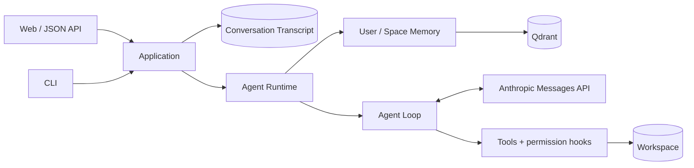

# Mini Code Agent

[中文](README.md) · [Architecture](docs/architecture.en.md) · [Memory and evaluation](docs/memory-and-evaluation.en.md) · [Usage and contribution](docs/usage.en.md)

[](https://github.com/JohnnyYwQ/mini-code-agent/actions/workflows/ci.yml)

[](LICENSE)

**A Coding Agent with resumable Conversations, cross-conversation Memory, and workspace tools.**

Work with the Agent in a local repository through Web or CLI: execute tools, resume previous Conversations, and recall user preferences and project conventions when relevant.
The project implements Agent state management, tool protocols, context compaction, and retrieval evaluation with Python/Django, the Anthropic Messages API, and Qdrant.

> The current version serves one trusted local User. File tools validate workspace paths, and shell commands use the workspace as their working directory. Production authentication and a complete sandbox are not implemented.

## Core capabilities

### Persistent Conversations and cross-conversation Memory

- **Conversation recovery:** SQLite persists the Conversation Transcript, including user, assistant, and tool protocol messages. Web and CLI share an application layer and can continue existing Conversations.
- **Scoped Memory:** User Memory carries information across workspaces; Space Memory is shared by Conversations within one workspace. The application establishes identity and Scope.
- **Extraction and recall:** The model can invoke the no-argument `remember` tool to extract Memory from a rolling window. Each Turn defaults to E5 + BM25 + RRF + BGE retrieval and injects up to five Memories as temporary system context.

### Agent Runtime and tool execution

- **Protocol loop:** Each Turn gets its own Agent Runtime, which handles `tool_use` / `tool_result`, tool errors, and a round limit until a final reply or runtime failure.
- **Tools and extensions:** Shell, file operations, glob, todo, and local skills are supported. Permissions are checked before execution, with interactive CLI confirmation for potentially destructive commands.
- **Context management:** Long tool outputs are saved to disk, older outputs are shortened, and summaries are generated at an estimated context threshold. The model's working context is compacted while the complete database Transcript is retained.

### Retrieval evaluation and engineering checks

- **Comparable retrieval pipelines:** BM25, E5, RRF fusion, and BGE reranking are measured on LongMemEval-S with consistent corpus and scoring rules.
- **Resumable evaluation:** Candidate retrieval and reranking run in separate processes. Cache identities include data, models, source, and parameters; per-question records support recovery, and actual CUDA execution is checked.
- **Automated checks:** Django tests, Ruff, mypy, coverage, pre-commit, and GitHub Actions use dependencies pinned by one `uv.lock`.

## LongMemEval retrieval results

Existing run record `20260816-cu124-v1` reports the following results on official cleaned LongMemEval-S data using the user-only retrieval indexing and scoring protocol.
Of 500 source cases, 30 Abstention Cases and 51 cases without user-side target evidence are excluded, leaving **419 scored cases**.

| Retrieval pipeline | RecallAll@5 | NDCG@5 | RecallAll@10 | NDCG@10 |
| --- | ---: | ---: | ---: | ---: |
| E5 + BM25 + RRF + BGE | **92.60%** | **94.74%** | **97.61%** | **95.69%** |

In that record, BGE improves RecallAll@5 by **1.91 percentage points** and NDCG@5 by **2.57 percentage points** over RRF without reranking.

**Evidence status:** The formal baseline, per-question records, and logs have not been published in the repository and independently reverified. These are previously recorded values.
They measure retrieval ranking, not end-to-end answer accuracy or an official leaderboard score. Product Memory and evaluation also use different candidate configurations.

[Full comparison, product/evaluation differences, exclusions, parameters, and reproduction →](docs/memory-and-evaluation.en.md)

## How one request runs



1. Application resolves the trusted User, Memory Space, and workspace from the Conversation, then persists the user message.
2. A new Agent Runtime recalls Memory within the current Scope and prepares the model's working context.
3. The Agent Loop calls the model, checks and executes tools, and returns tool results. File tools validate paths; shell commands use the workspace as `cwd`.
4. After a visible final reply, generated protocol messages are appended atomically. Runtime failure leaves the user message saved without committing a partial generated Transcript.

If Memory initialization or recall fails, the Agent logs the error and continues the Turn. File changes and Memory writes already made by tools are not rolled back if Transcript persistence fails.

[Full responsibilities, domain objects, and failure handling →](docs/architecture.en.md)

## Quick start

You need Python 3.13+, [uv](https://docs.astral.sh/uv/getting-started/installation/), and access to the Anthropic API
or a compatible endpoint.

> Memory initialization loads E5/BM25; the first rerank of nonempty candidates loads BGE. Missing model caches require downloads, so reserve several GB of disk space.

```bash
git clone https://github.com/JohnnyYwQ/mini-code-agent.git
cd mini-code-agent
uv sync --locked
cp .env.example .env
```

Edit `.env`:

```env
MODEL_ID=your_model_id
ANTHROPIC_API_KEY=your_api_key
# ANTHROPIC_BASE_URL=
```

Start the Web app:

```bash
uv run --locked python src/main/python/manage.py migrate
uv run --locked python src/main/python/manage.py runserver
```

Open `http://127.0.0.1:8000/` and create a Conversation. Or use the CLI:

```bash
uv run --locked python src/main/python/cli.py
uv run --locked python src/main/python/cli.py --list
uv run --locked python src/main/python/cli.py --resume <conversation-uuid>
```

The CLI resolves its workspace from the launch directory; Web and CLI share one non-login local User. See the
[usage and contributor guide](docs/usage.en.md) for every environment variable, other-workspace operation,
the JSON API, Qdrant configuration, and development commands.

## Project structure

Sources, resources, and tests follow the `src/main` and `src/test` layout. Python and uv handle execution and dependencies.

```text
mini-code-agent/
├── src/
│   ├── main/
│   │   ├── python/
│   │   │   ├── manage.py
│   │   │   ├── cli.py
│   │   │   ├── config/
│   │   │   ├── chat/
│   │   │   ├── core/
│   │   │   │   └── memory/
│   │   │   └── evals/
│   │   │       └── memory_retrieval/
│   │   └── resources/
│   │       ├── templates/chat/
│   │       └── static/chat/
│   └── test/
│       └── python/tests/
│           ├── chat/
│           └── memory/
├── scripts/
├── docs/
├── pyproject.toml
└── uv.lock
```

`config` contains Django settings, `chat` contains the Conversation application layer and Web entry points, `core` contains the Agent and Memory, and `evals` contains independent evaluation code.
The local SQLite database is `db.sqlite3` at the repository root and is excluded from version control.

## Development checks

```bash
uv run --locked ruff format --check .
uv run --locked ruff check .
uv run --locked mypy
uv run --locked python src/main/python/manage.py test
```

The default test command discovers `src/test/python/tests/`. See the [usage and contributor guide](docs/usage.en.md) for coverage scope, real-model smoke tests, and CI commands.

## Current boundaries and next steps

| Area | Current state | Next steps |
| --- | --- | --- |
| Memory | Extraction, ADD, content deduplication, and scoped recall | UPDATE/DELETE, Memory Events, and index recovery |
| Runtime feedback | Synchronous replies and terminal tool hook output | Independently persisted runtime traces, Web tool traces, and streaming |
| Evaluation evidence | Recorded results and reproduction code | Recover, independently verify, and publish formal artifacts |
| Intended use | One trusted local User; embedded Qdrant for one process | Shared Qdrant service for concurrent entry points; authentication and isolation for remote use |

Moving or renaming a workspace does not migrate its existing Memory Space. See the [usage guide](docs/usage.en.md) for operational limits.

## Documentation

| Document | Contents |
| --- | --- |
| [Architecture](docs/architecture.en.md) | Application layer, Agent Runtime, protocol loop, state, and failure handling |
| [Memory and evaluation](docs/memory-and-evaluation.en.md) | Extraction, recall, LongMemEval protocol, results, and reproduction |
| [Usage and contribution](docs/usage.en.md) | Configuration, Web/CLI, API, storage, tests, and CI |
| [Agent developer resume notes (Chinese)](docs/project-resume.md) | Ready-to-use project description, implementation evidence, and interview topics |

The three core technical guides have matching Chinese versions. Domain vocabulary and design decisions live in [CONTEXT.md](CONTEXT.md) and the [ADRs](docs/adr/).

## Acknowledgements and license

The early minimal Agent Loop was inspired by [shareAI-lab/learn-claude-code](https://github.com/shareAI-lab/learn-claude-code).
The project subsequently evolved around Conversation persistence, scoped Memory, retrieval evaluation, and Web/CLI integration.

[MIT License](LICENSE) © 2026 JohnnyYwQ
