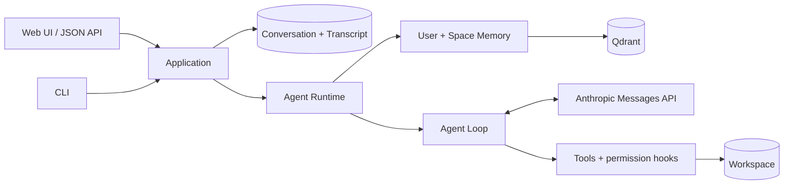

# Mini Code Agent

[English](README.en.md) · [架构指南](docs/architecture.md) · [Memory 与评测](docs/memory-and-evaluation.md) · [使用与贡献](docs/usage.md)

[](https://github.com/JohnnyYwQ/mini-code-agent/actions/workflows/ci.yml)

[](LICENSE)

围绕**有状态 Coding Agent** 构建的个人工程实践：让 Conversation 可持久恢复，让 Memory
在明确的 User/Space Scope 中跨 Turn 与跨 Conversation 工作，并把模型、工具、权限和上下文管理
收拢到一次性的 Agent Runtime 中。

Mini Code Agent 不是教程项目，也不以生产级 Agent 自居。它关注的是一组可以运行、测试和评测的
工程边界：Django Web/CLI、Anthropic Messages API、工作区工具、Qdrant Memory、混合检索、
BGE Reranking，以及可复现的 LongMemEval Retrieval Baseline。

> **适用范围：** 当前版本面向可信本地、单 User 环境。Agent 可以执行 shell 命令并修改工作区文件；
> Web、JSON API 和工具执行层均不具备生产认证或完整沙箱，请勿直接暴露到公网。

## 工程重点

### 持久 Conversation 与作用域 Memory

- Conversation Transcript 持久化完整的用户、助手和工具协议消息，进程重启后仍可恢复。
- 一个 Memory Space 对应一个本地工作区，可由多个 Conversation 共享 Space Memory。
- User Memory 跨该 User 的所有 Memory Space 可用；Space Memory 只在目标 Memory Space 内可见。
- 每个 Turn 自动组合 E5 dense 与 BM25 keyword 候选，经 RRF 融合后由
  `BAAI/bge-reranker-v2-m3` 重排。
- recalled Memory 只作为当前 Turn 的临时 Memory Context，不会伪装成 Conversation Transcript。

### Agent Runtime 与 Agent Loop

- Web 和 CLI 都通过同一个 Application 边界解析 Conversation、User、Memory Space 与工作区。
- 每个 Turn 创建一个绑定固定工作区和 Memory Context 的 Agent Runtime，不把 Conversation
  变成长驻进程。
- Agent Loop 在 Anthropic Messages API 的 `tool_use` / `tool_result` 协议上循环，直到最终回复、
  失败或达到轮次限制。
- 内置工具覆盖 shell、文件读写、glob、todo、skills、上下文压缩与 `remember`；权限 hook
  在执行前后介入。
- 上下文压缩只改变后续模型调用看到的工作上下文，不覆盖数据库中的权威 Transcript。

### 可运行的端到端工程

- Django Web UI、CSRF 保护的 JSON API 与 `prompt_toolkit` CLI 共用同一应用与持久化路径。
- SQLite 保存 Conversation；Qdrant 保存可检索 Memory，并支持嵌入式或 service URL。
- 文件工具限制在 Conversation 绑定的工作区内；CLI 可对潜在破坏性命令进行交互确认。
- Python 3.13、`uv.lock`、Django tests、Ruff、mypy、coverage、pre-commit 与 GitHub Actions
  组成可复现的开发检查。

## 技术组成

| 层次 | 当前实现 |
| --- | --- |
| 应用 | Python 3.13、Django 5.2、SQLite |
| 模型 | Anthropic Python SDK、Messages API |
| Memory | Qdrant、FastEmbed E5、BM25、RRF、FlagEmbedding BGE |
| 入口 | Django templates、原生 JavaScript、`prompt_toolkit` |
| Agent 能力 | 工作区工具、permission hooks、skills、todo、compaction |
| 工程检查 | uv、Ruff、mypy、coverage、pre-commit、GitHub Actions |

## LongMemEval 检索结果

固定 CUDA 运行 `20260816-cu124-v1` 使用官方 cleaned LongMemEval-S 数据、官方 user-only
索引范围、eligibility 与 `@5`/`@10` 公式，评测本项目的 E5 + BM25 + RRF + BGE 检索链。
500 个源样本中，30 个 Abstention Case 与 51 个缺少 user-side 目标证据的样本按协议排除，
最终计分 419 个样本。

| Retrieval pipeline | RecallAll@5 | NDCG@5 | RecallAll@10 | NDCG@10 |
| --- | ---: | ---: | ---: | ---: |
| E5 + BM25 + RRF + BGE | **92.60%** | **94.74%** | **97.61%** | **95.69%** |

这些数字只衡量**检索**，不是端到端 LongMemEval QA、官方 leaderboard 成绩或通用 Agent
性能结论。正式运行的 baseline、逐题记录与日志尚未取回仓库并独立复核；当前页面报告的是已记录结果，
不把缺失的产物描述成已发布证据。

[查看完整链路对比、排除规则、模型 revision、CUDA 验证、哈希、限制与复现流程 →](docs/memory-and-evaluation.md)

## 架构摘要



一次 Turn 的关键路径：

1. Web 或 CLI 选择/创建 Conversation；Application 从持久化记录可信地推导 User、
   Memory Space 与工作区。
2. Application 先保存用户消息，再为本 Turn 创建 Agent Runtime，并召回 Scope 内 Memory。
3. Agent Loop 调用模型和获准工具；工具始终在 Conversation 绑定的工作区与权限策略内运行。
4. 成功后，助手与工具协议消息作为有序批次写入 Conversation Transcript；失败时不持久化部分生成结果。

[阅读完整架构、职责边界、领域对象与真实 Turn 数据流 →](docs/architecture.md)

## 快速开始

要求 Python 3.13+、[uv](https://docs.astral.sh/uv/getting-started/installation/) 以及可用的
Anthropic API 或兼容端点。

> Memory 首次召回时会按需下载 BGE reranker，请提前预留数 GB 磁盘空间。

```bash
git clone https://github.com/JohnnyYwQ/mini-code-agent.git
cd mini-code-agent
uv sync --locked
cp .env.example .env
```

编辑 `.env`：

```env
MODEL_ID=your_model_id
ANTHROPIC_API_KEY=your_api_key
# ANTHROPIC_BASE_URL=
```

启动 Web：

```bash
uv run --locked python config/manage.py migrate
uv run --locked python config/manage.py runserver
```

打开 `http://127.0.0.1:8000/`，新建 Conversation 后即可开始。也可以使用 CLI：

```bash
uv run --locked python config/cli.py
uv run --locked python config/cli.py --list
uv run --locked python config/cli.py --resume <conversation-uuid>
```

CLI 从启动时的当前目录解析工作区；Web 与 CLI 共享同一个不可登录的本地 User。完整环境变量、
其他工作区运行方式、JSON API、Qdrant 配置与开发命令见[使用与贡献指南](docs/usage.md)。

## 当前边界

- 仅支持可信本地、单 User 使用；没有登录、API token、多 User 隔离或远程部署认证。
- `bash` 使用系统 shell；denylist 和工作区路径检查不是完整安全沙箱。
- Django 仍使用开发设置；嵌入式 Qdrant 适合单进程，并发入口应改用共享 Qdrant 服务。
- 模型回复尚未流式输出，Web 也没有完整工具调用轨迹可视化。
- Memory UPDATE/DELETE、Memory Event 接入和自动索引恢复尚未完成。
- 工作区移动或重命名不会自动迁移既有 Memory Space。

## 文档

| 文档 | 内容 |
| --- | --- |
| [架构指南](docs/architecture.md) | Web/CLI、Application、Agent Runtime、Agent Loop、工具、持久化与一轮 Turn |
| [Memory 与评测](docs/memory-and-evaluation.md) | Scope、召回链、LongMemEval 协议、完整结果、证据状态与 CUDA 复现 |
| [使用与贡献](docs/usage.md) | 安装、配置、Web/CLI、JSON API、安全、Qdrant、测试与 CI |

所有公开指南均提供结构和事实对应的[英文版本](README.en.md)。

## 路线图

- 补齐并独立复核正式 Retrieval Baseline 产物。
- 完成 Memory 生命周期与索引恢复。
- 增加流式响应和工具调用轨迹可视化。
- 若进入远程或多人场景，再引入认证、隔离与更强的工具沙箱。

## 致谢

项目早期的最小 Agent Loop 思路受
[shareAI-lab/learn-claude-code](https://github.com/shareAI-lab/learn-claude-code) 启发；
本仓库随后围绕持久 Conversation、作用域 Memory、检索评测、Web/CLI 与工程检查独立演进，
不是该项目的教程 fork。

## 许可证

[MIT License](LICENSE) © 2026 JohnnyYwQ
