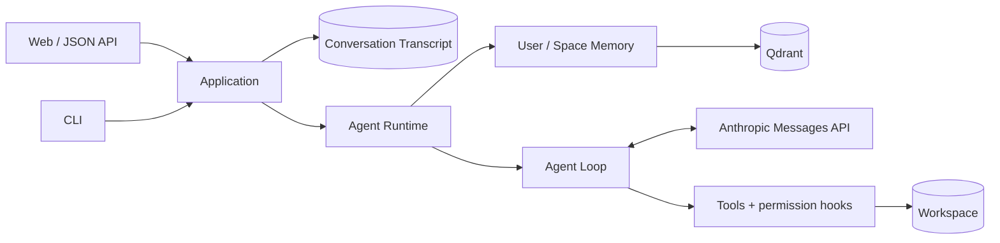

# Mini Code Agent

[English](README.en.md) · [架构指南](docs/architecture.md) · [Memory 与评测](docs/memory-and-evaluation.md) · [使用与贡献](docs/usage.md)

[](https://github.com/JohnnyYwQ/mini-code-agent/actions/workflows/ci.yml)

[](LICENSE)

**支持会话恢复、跨会话 Memory 和工作区工具调用的 Coding Agent。**

通过 Web 或 CLI 在本地代码仓库中与 Agent 协作：执行工具、恢复历史会话，并按需召回用户偏好和项目约定。
项目围绕 Agent 的状态管理、工具协议、上下文压缩与检索评测展开，使用 Python/Django、Anthropic Messages API 和 Qdrant 实现。

> 当前版本用于可信本地、单用户环境。文件工具检查工作区路径，shell 以工作区为执行目录；尚无生产认证或完整沙箱。

## 核心能力

### 会话持久化与跨会话 Memory

- **会话恢复：** SQLite 持久化 Conversation Transcript，保存用户、助手与工具协议消息；Web 和 CLI 共用同一应用层，支持继续已有 Conversation。
- **作用域 Memory：** User Memory 保存跨工作区可用的信息，Space Memory 在同一工作区的多个 Conversation 间共享。身份和 Scope 由应用层确定。
- **提取与召回：** 模型通过无参数 `remember` 触发滚动窗口提取；每个 Turn 默认用 E5 + BM25 + RRF + BGE 检索，最多注入 5 条 Memory 作为临时 system context。

### Agent Runtime 与工具执行

- **协议循环：** 每个 Turn 创建独立 Agent Runtime，处理 `tool_use` / `tool_result`、工具错误和轮次上限，直到获得最终回复或运行失败。
- **工具与扩展：** 支持 shell、文件读写、glob、todo 和本地 skills；执行前检查权限，CLI 对潜在破坏性命令提供交互确认。
- **上下文管理：** 对长工具输出落盘、裁剪旧输出，并在达到估算上下文阈值时生成摘要；压缩模型工作上下文，同时保留数据库中的完整 Transcript。

### 检索评测与工程验证

- **可比较的检索链：** 在 LongMemEval-S 上分别记录 BM25、E5、RRF 融合及 BGE 重排结果，使用一致的语料和评分口径。
- **可恢复的评测：** 候选召回与重排分进程执行，按数据、模型、源码和参数生成缓存身份；逐题落盘，支持中断恢复，并校验实际 CUDA 执行。
- **自动化检查：** 使用 Django tests、Ruff、mypy、coverage、pre-commit 和 GitHub Actions；依赖统一由 `uv.lock` 锁定。

## LongMemEval 检索结果

既有运行记录 `20260816-cu124-v1` 在官方 cleaned LongMemEval-S 数据上，按 user-only 索引与检索评分协议计算以下结果。
500 个源样本排除 30 个 Abstention Case 和 51 个无 user-side 目标证据的样本，最终计分 **419 个样本**。

| Retrieval pipeline | RecallAll@5 | NDCG@5 | RecallAll@10 | NDCG@10 |
| --- | ---: | ---: | ---: | ---: |
| E5 + BM25 + RRF + BGE | **92.60%** | **94.74%** | **97.61%** | **95.69%** |

在该记录中，BGE 相对未重排的 RRF 将 RecallAll@5 提高 **1.91 个百分点**、NDCG@5 提高 **2.57 个百分点**。

**证据状态：** 正式 baseline、逐题记录和日志尚未在仓库发布并独立复核，以上为既有记录值。
指标衡量检索排序，不代表端到端回答准确率或官方 leaderboard 成绩；产品 Memory 与评测的候选配置也有所不同。

[完整对比、产品与评测差异、排除规则、运行参数和复现流程 →](docs/memory-and-evaluation.md)

## 一轮请求如何执行



1. Application 根据 Conversation 解析可信 User、Memory Space 和工作区，先持久化用户消息。
2. 为本 Turn 创建 Agent Runtime，检索当前 Scope 内的 Memory，准备模型工作上下文。
3. Agent Loop 调用模型、检查并执行工具、返回工具结果；文件工具校验路径，shell 使用工作区作为 `cwd`。
4. 得到可见最终回复后，原子追加本轮生成的协议消息；运行失败时保留用户消息，不提交部分生成的 Transcript。

Memory 初始化或召回失败时，Agent 记录错误并继续当前 Turn。工具已经产生的文件修改或 Memory 写入不会随 Transcript 提交失败而回滚。

[完整职责边界、领域对象与失败处理 →](docs/architecture.md)

## 快速开始

要求 Python 3.13+、[uv](https://docs.astral.sh/uv/getting-started/installation/) 以及可用的
Anthropic API 或兼容端点。

> 首次构建 Memory 会加载 E5/BM25；首次对非空候选重排时会加载 BGE。缺少模型缓存时需要下载，请预留数 GB 磁盘空间。

```bash
git clone https://github.com/JohnnyYwQ/mini-code-agent.git
cd mini-code-agent
uv sync --locked
cp .env.example .env
```

编辑 `.env`：

```env
MODEL_ID=your_model_id
ANTHROPIC_API_KEY=your_api_key
# ANTHROPIC_BASE_URL=
```

启动 Web：

```bash
uv run --locked python src/main/python/manage.py migrate
uv run --locked python src/main/python/manage.py runserver
```

打开 `http://127.0.0.1:8000/`，新建 Conversation 后即可开始。也可以使用 CLI：

```bash
uv run --locked python src/main/python/cli.py
uv run --locked python src/main/python/cli.py --list
uv run --locked python src/main/python/cli.py --resume <conversation-uuid>
```

CLI 从启动时的当前目录解析工作区；Web 与 CLI 共享同一个不可登录的本地 User。完整环境变量、
其他工作区运行方式、JSON API、Qdrant 配置与开发命令见[使用与贡献指南](docs/usage.md)。

## 项目结构

源码、资源与测试采用 `src/main`、`src/test` 布局，运行和依赖管理使用 Python 与 uv。

```text
mini-code-agent/
├── src/
│   ├── main/
│   │   ├── python/
│   │   │   ├── manage.py
│   │   │   ├── cli.py
│   │   │   ├── config/
│   │   │   ├── chat/
│   │   │   ├── core/
│   │   │   │   └── memory/
│   │   │   └── evals/
│   │   │       └── memory_retrieval/
│   │   └── resources/
│   │       ├── templates/chat/
│   │       └── static/chat/
│   └── test/
│       └── python/tests/
│           ├── chat/
│           └── memory/
├── scripts/
├── docs/
├── pyproject.toml
└── uv.lock
```

`config` 保存 Django 配置，`chat` 承载会话应用层和 Web 入口，`core` 承载 Agent 与 Memory，`evals` 保存独立评测代码。
本地 SQLite 数据库位于根目录 `db.sqlite3`，不纳入版本控制。

## 开发检查

```bash
uv run --locked ruff format --check .
uv run --locked ruff check .
uv run --locked mypy
uv run --locked python src/main/python/manage.py test
```

默认测试入口自动发现 `src/test/python/tests/`。覆盖率范围、真实模型 smoke 与 CI 命令见[使用与贡献指南](docs/usage.md)。

## 当前边界与后续工作

| 方向 | 当前状态 | 后续工作 |
| --- | --- | --- |
| Memory | 已实现提取、ADD、内容去重和作用域召回 | UPDATE/DELETE、Memory Event 与索引恢复 |
| 运行反馈 | 同步回复，终端工具 hook 输出 | 独立持久化运行轨迹、Web 工具轨迹、流式响应 |
| 评测证据 | 已有运行记录和复现代码 | 取回、独立校验并发布正式产物 |
| 使用范围 | 可信本地单用户；嵌入式 Qdrant 供单进程使用 | 并发入口使用共享 Qdrant 服务；远程场景需认证与隔离 |

工作区移动或重命名不会自动迁移既有 Memory Space。详细运行限制见[使用指南](docs/usage.md)。

## 文档

| 文档 | 内容 |
| --- | --- |
| [架构指南](docs/architecture.md) | 应用层、Agent Runtime、协议循环、状态与失败处理 |
| [Memory 与评测](docs/memory-and-evaluation.md) | 提取和召回、LongMemEval 协议、结果与复现 |
| [使用与贡献](docs/usage.md) | 配置、Web/CLI、API、存储、测试与 CI |
| [Agent 开发简历素材](docs/project-resume.md) | 可直接使用的项目描述、实现证据与面试展开点 |

三篇核心技术指南均提供对应的英文版本；领域词汇与设计决策见 [CONTEXT.md](CONTEXT.md) 和 [ADR](docs/adr/)。

## 致谢与许可证

早期最小 Agent Loop 思路受 [shareAI-lab/learn-claude-code](https://github.com/shareAI-lab/learn-claude-code) 启发。
项目随后围绕会话持久化、作用域 Memory、检索评测与 Web/CLI 集成演进。

[MIT License](LICENSE) © 2026 JohnnyYwQ
