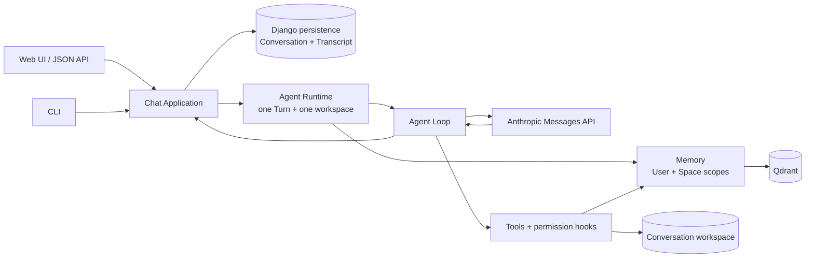

# Mini Code Agent Architecture Guide

[中文](architecture.md) · [Back to English README](../README.en.md)

This guide explains the boundaries that exist in the current code: how one Turn enters through Web or CLI, passes through Application into a per-Turn Agent Runtime and Agent Loop, calls tools, Memory, and the Anthropic Messages API, and persists the authoritative Conversation Transcript. It describes trusted-local, single-user version 0.2, not a target architecture.

## Reading paths

- For the system shape, start with the diagram and responsibility boundaries.
- To trace a request, read “One real Turn.”
- To separate Conversation, Runtime, Transcript, and Memory, read “Domain objects.”
- To verify the claims, use the code and governing ADR index at the end.

## Architecture at a glance

Web and CLI are adapters: they neither decide Memory ownership nor run the model loop directly. Application is the trusted orchestration boundary. It resolves a persisted Conversation, derives the User, Memory Space, and workspace from that Conversation, and creates an Agent Runtime for the current Turn. The Runtime executes its Agent Loop in one fixed workspace and Memory Context; the Conversation never becomes a resident process.

## Responsibility boundaries

### Web and CLI entry points

Web lives in [`config/chat/views.py`](../config/chat/views.py), which provides the page, Conversation selection, creation, and the `/api/chat/` JSON adapter. The page can browse every Conversation owned by the local User and groups them by the Memory Space workspace. If a workspace has disappeared, its Transcript remains readable but a new Turn returns a conflict error.

The current CLI entry point is [`config/cli.py`](../config/cli.py), not the former `config/core/agent.py`. By default it resolves the launch directory as its workspace and creates a Conversation. `--list` and `--resume` only expose Conversations in the Memory Space for that workspace. Web and CLI share one persistent, non-login local User.

Both adapters call the same Application use cases and the shared composition in [`config/chat/composition.py`](../config/chat/composition.py). Web has no interactive confirmation channel, so potentially destructive commands are rejected; CLI may ask for terminal confirmation.

### Application

[`config/chat/application.py`](../config/chat/application.py) is the trusted orchestration boundary for Conversations and Turns. It:

- finds a Conversation through the local User and verifies ownership;
- derives stable IDs, the canonical workspace path, and Memory Context from its Memory Space;
- rejects a missing workspace before execution;
- persists the user message first, loads the complete Conversation Transcript, then creates the runner for this Turn;
- atomically appends the Turn's generated top-level protocol messages only after the Agent succeeds with a visible reply.

A client cannot submit `user_id` or `space_id` to widen Scope. The entry point supplies a Conversation ID for location; Application remains the trust source for the User, Memory Space, and workspace.

### Agent Runtime and Agent Loop

The Agent Runtime in [`config/core/agent_runtime.py`](../config/core/agent_runtime.py) is a transient boundary for one Turn. It binds one workspace, one Memory Context, tool collection, Todo state, SkillManager, and ContextCompactor. The next Turn resolves the persisted Conversation again and constructs a new Runtime.

The Agent Loop is the repeated process inside that Runtime: prepare model context, call the Anthropic Messages API, and append the assistant message. When `stop_reason` is `tool_use`, it executes permitted tools, sends their `tool_result` blocks back as a user-role protocol message, and continues. The loop stops on a final response or the round limit.

The `messages` sent to Anthropic use the Messages API `user` / `assistant` protocol roles, with tool requests and results retained as content blocks. The system prompt, recalled Memory, tool schemas, model ID, and token limit are separate request fields; they are not disguised as user messages in the Conversation.

Context compaction changes only the working context for later model calls and may save a pre-compaction snapshot in the workspace. It does not replace the complete top-level protocol messages in the authoritative database-backed Conversation Transcript.

### Tool execution

[`config/core/tooling.py`](../config/core/tooling.py) defines built-in tools, workspace path checks, permission hooks, and logging/output hooks. Agent Runtime composes Todo, skills, compaction, and `remember` around them. File tools must remain inside the Runtime's fixed workspace, and shell commands use that workspace as `cwd`.

The permission layer is not a security sandbox. A denylist blocks a small set of explicit commands and potentially destructive commands depend on the entry point's confirmation policy; ordinary `bash` still uses `shell=True`. Most tool failures become `tool_result` content so the Agent Loop can decide how to continue instead of immediately becoming an application error response.

### Memory

[`config/core/memory/`](../config/core/memory/) receives the Memory Context established by Application; it never creates, changes, or authorizes a User or Memory Space. Before the first model call in every Turn, it searches the current User Memory and current Space Memory with the latest user query. E5 dense and BM25 candidates are fused and may be reranked by BGE. At most five recalled Memories are injected as temporary system context.

`remember` is a no-argument tool available to the outer model. Its trusted handler supplies the current Memory Context and builds an extraction window from visible user/assistant text in up to five recent completed Turns plus the current Turn; tool activity is excluded. The extractor can classify a proposal only as User Memory or Space Memory and cannot provide ownership IDs.

Qdrant currently stores Memory Source Text and retrieval payload. ADD validates the complete extraction result and then writes Memories sequentially, not as one multi-Memory transaction. If a later write fails, earlier successful writes remain.

### Persistence and the external API

[`config/chat/models.py`](../config/chat/models.py) persists Memory Space, Conversation, and ordered ConversationMessage records through Django. A Conversation has a stable UUID, title, timestamps, and exactly one Memory Space. ConversationMessage JSON preserves text, `tool_use`, and `tool_result` blocks; Web and CLI display only a visible-text projection.

The Anthropic Messages API is the Agent Loop's external inference boundary, not the persistence layer. Each response remains in the Runtime's generated list until the complete run returns a final visible assistant reply. Only then does Application append the list to the Conversation Transcript. Qdrant is the current source for Memory and remains separate from the Django Transcript.

## Domain objects

| Concept | Current meaning | Do not confuse it with |
| --- | --- | --- |
| Conversation | Related Turns sharing a stable Conversation ID; belongs to exactly one Memory Space and survives process restarts | Agent Runtime, one request |
| Turn | One completed exchange from a user message to the final visible agent reply | Whole Conversation, one message |
| Conversation Transcript | Ordered persisted user/assistant protocol messages, including intermediate tool requests and results | recalled Memory, complete model context |
| Agent Runtime | Transient boundary that processes one Turn in one fixed workspace and Memory Context | durable Conversation, background worker |
| Agent Loop | Repeated model request, tool execution, and result return within a Runtime | HTTP handler, Conversation |
| Memory Context | Trusted User and Memory Space derived by Application, bounding eligible Scopes | recalled Memory, the search filter itself |
| recalled Memory | Query-dependent projection of Memory used temporarily for the current Turn | Conversation Transcript |
| User Memory | Memory owned by one User and available across all of that User's Memory Spaces | globally public Memory |
| Space Memory | Memory owned by one User and one Memory Space, shared by Conversations in that Space | one Conversation's history |

The central invariant is: **a Conversation is durable, while an Agent Runtime is created for each Turn; the Conversation Transcript is authoritative history, while recalled Memory is temporary context.** Resuming one Conversation proves Transcript persistence. Space Memory across Conversations is demonstrated only when a different Conversation in the same Memory Space recalls it.

## One real Turn

### 1. Locate the Conversation at the entry point

A Web POST sends `conversation_id` and message to `/api/chat/`. CLI uses the Conversation it just created or validated through `--resume`. The adapter parses input and delegates to `run_conversation_turn`.

### 2. Establish trusted runtime context

Application queries the Conversation through the shared local User, reads its one Memory Space, and checks that the stored workspace path is still a directory. It builds a `ConversationRuntimeContext` with the Conversation ID, fixed workspace, and Memory Context made from stable owner/space IDs. Ownership, Conversation, or workspace resolution failures stop before an Agent Runtime exists.

### 3. Persist the user message first

After trimming a non-empty query, Application immediately stores the user message; the first user message also supplies the Conversation title. It then reloads the full ordered Transcript from the database. If a later model or tool step fails, that user message remains as unanswered history.

### 4. Create this Turn's Agent Runtime and recall

Composition creates a Runtime with the resolved workspace and Memory Context and attaches an Anthropic client and shared production Memory. The Runtime recalls User Memory and current Space Memory with the latest query. Up to five Scope-labelled results enter `<retrieved-memory>` system context. They are not appended to the Transcript and are recomputed next Turn.

### 5. Iterate over model and tools

The Runtime sends the compaction-prepared Transcript, system context, and tool schemas to the Anthropic Messages API. For a tool request, the permission hook runs first. The handler then executes in the fixed workspace or trusted Memory Context, and a `tool_result` returns to the model. `remember` may write User Memory or current Space Memory. Iteration continues until the model returns a final reply.

### 6. Commit generated Transcript after success

The Runtime returns only new assistant and tool-result protocol messages for this Turn. Application verifies that they contain visible assistant text, then appends the batch and updates the timestamp in one database transaction. Web returns the visible text as JSON; CLI prints the same result. The next Turn reloads the complete Conversation from the database.

## Failure boundaries

| Failure location | Current outcome |
| --- | --- |
| Local User, Conversation, ownership, or workspace cannot be resolved | fatal; no Runtime, tools, or Memory operation starts |
| Production Memory initialization fails | warning is logged; Runtime has no Memory and the Turn continues |
| Per-Turn recall fails | warning is logged; no recalled Memory is injected and the Turn continues |
| `remember` extraction or write fails | error returns as a tool result; Turn may continue; earlier non-atomic writes remain |
| Permission hook rejects a tool | rejection returns to the model and the tool does not execute |
| Ordinary tool fails | error text returns to the model and the Agent Loop may continue |
| Anthropic request fails or round limit is exceeded | Agent run fails; user message is stored, partial generated Transcript is not |
| Final response has no visible assistant text | Agent run fails and generated Transcript is not stored |
| Successful-run Transcript batch cannot be written | database transaction rolls back that generated batch; user message remains |

## Current limits and security boundary

- This is a trusted-local, single-user application with no login, API token, multi-user authorization, or public-deployment boundary.
- Web and CLI share one local User; Memory Context is trustworthy because Application does not accept owner IDs from clients.
- File path confinement is not a shell sandbox; `bash` can reach resources allowed to the process.
- Web has no streaming response or complete tool trace; it projects only visible text from the persisted Transcript.
- Moving or renaming a workspace does not migrate its Memory Space automatically; old Conversations remain readable but cannot run.
- recalled Memory uses failure-tolerant degradation, so a successful Turn does not prove that Memory infrastructure was available.
- Memory UPDATE/DELETE, complete Memory Event history, cross-Qdrant/Django transactions, and automatic index recovery are not implemented.

## Implementation and decision index

- Entry and orchestration: [`views.py`](../config/chat/views.py), [`cli.py`](../config/cli.py), [`application.py`](../config/chat/application.py), [`composition.py`](../config/chat/composition.py)
- Execution: [`agent_runtime.py`](../config/core/agent_runtime.py), [`tooling.py`](../config/core/tooling.py), [`compaction.py`](../config/core/compaction.py)
- State: [`models.py`](../config/chat/models.py), [`memory/`](../config/core/memory/)
- Scope and trust: [ADR-0002](adr/0002-user-and-space-memory-scopes.md), [ADR-0003](adr/0003-share-one-local-user-across-entry-points.md), [ADR-0004](adr/0004-locate-memory-spaces-by-workspace-path.md)
- Conversation and Turn: [ADR-0005](adr/0005-persist-and-resume-conversations.md), [ADR-0006](adr/0006-retrieve-memory-for-each-turn.md), [ADR-0007](adr/0007-extract-memory-from-a-five-turn-window.md), [ADR-0008](adr/0008-bind-agent-runtime-to-conversation-workspace.md)

## Continue reading

- [English README](../README.en.md)
- [中文架构指南](architecture.md)
- [Project domain glossary](../CONTEXT.md)
