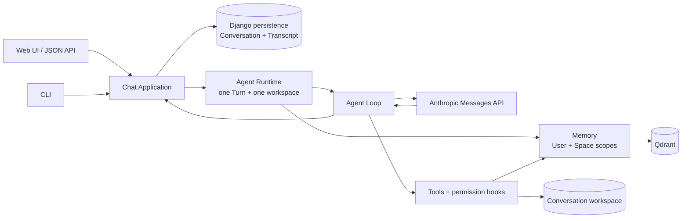

# Mini Code Agent 架构指南

[English](architecture.en.md) · [返回中文 README](../README.md)

本文解释当前代码中的真实边界：一次 Turn 如何从 Web 或 CLI 进入 Application，经由一次性的 Agent Runtime 和 Agent Loop 调用工具、Memory 与 Anthropic Messages API，并把权威 Conversation Transcript 持久化。这里描述的是可信本地单用户版本 0.2，不是目标架构。

## 阅读路线

- 想先建立全局认识：阅读架构图和职责边界。
- 想跟踪一次请求：阅读“一次真实 Turn”。
- 想分清 Conversation、Runtime、Transcript 与 Memory：阅读“领域对象”。
- 想核对实现：文末列出了代码入口和 governing ADR。

## 架构总览

Web 与 CLI 只是 adapter；它们不决定 Memory 所有权，也不直接运行模型循环。Application 是可信编排边界。它解析持久化 Conversation，由 Conversation 推导 User、Memory Space 和工作区，再为当前 Turn 创建 Agent Runtime。Agent Runtime 在固定工作区和 Memory Context 内运行 Agent Loop；Conversation 本身不会变成常驻进程。

## 职责边界

### Web 与 CLI 入口

Web 由 [`config/chat/views.py`](../config/chat/views.py) 提供页面、Conversation 选择、新建操作和 `/api/chat/` JSON adapter。页面可以浏览本地 User 的所有 Conversation，并按 Memory Space 的工作区分组；工作区已不存在时仍可读取 Transcript，但新 Turn 返回冲突错误。

CLI 的当前入口是 [`config/cli.py`](../config/cli.py)，不是旧的 `config/core/agent.py`。它默认把启动时的当前目录解析为工作区并新建 Conversation；`--list` 与 `--resume` 只查看或恢复这个工作区所属 Memory Space 中的 Conversation。Web 和 CLI 共享同一个不可登录的持久化本地 User。

两个入口最终都调用相同的 Application 用例和 [`config/chat/composition.py`](../config/chat/composition.py) 装配逻辑。Web 不提供交互式危险命令确认，因此潜在破坏性命令会被拒绝；CLI 可以在终端确认。

### Application

[`config/chat/application.py`](../config/chat/application.py) 是 Conversation 与 Turn 的可信编排边界。它负责：

- 按本地 User 查找 Conversation，并验证所有权；
- 从 Conversation 的 Memory Space 推导稳定 ID、规范化工作区路径和 Memory Context；
- 在运行前拒绝不存在的工作区；
- 先保存用户消息，加载完整 Conversation Transcript，再创建当前 Turn 的 runner；
- 仅在 Agent 成功并产生可见回复后，原子地追加本轮生成的顶层 protocol messages。

客户端不能提交 `user_id` 或 `space_id` 来扩大 Scope。Conversation ID 是入口提供的定位信息，Application 才是 User、Memory Space 与工作区的信任来源。

### Agent Runtime 与 Agent Loop

[`config/core/agent_runtime.py`](../config/core/agent_runtime.py) 中的 Agent Runtime 是一个 Turn 的临时执行边界。它固定绑定一个工作区、一个 Memory Context、工具集合、Todo 状态、SkillManager 和 ContextCompactor。下一个 Turn 会从持久化 Conversation 重新解析上下文并创建新的 Runtime。

Agent Loop 是 Runtime 内部的重复过程：准备模型上下文，调用 Anthropic Messages API，追加 assistant message；若响应的 `stop_reason` 是 `tool_use`，则执行获准工具，把 `tool_result` 作为 user-role protocol message 返回模型，然后继续。模型给出最终回复或达到 round limit 时循环结束。

发送给 Anthropic 的 `messages` 使用 Messages API 的 `user` / `assistant` protocol roles；工具请求和结果保留在 content blocks 中。system prompt、recalled Memory、工具 schema、模型 ID 和 token 上限作为请求的其他字段发送，不会伪装成 Conversation 中的用户消息。

Context compaction 只改变给后续模型调用的工作上下文，并可在工作区保存压缩前快照；数据库中的权威 Conversation Transcript 仍保存完整顶层 protocol messages，不会被压缩摘要覆盖。

### 工具执行

[`config/core/tooling.py`](../config/core/tooling.py) 定义内置工具、工作区路径检查、权限 hook 与日志/输出 hook；`todo`、skills、compaction 和 `remember` 由 Agent Runtime 组合进去。文件工具必须留在 Runtime 的固定工作区，shell 也以该目录作为 `cwd`。

权限检查不是安全沙箱。denylist 会拒绝少量明确命令，潜在破坏性命令依赖入口的确认策略；普通 `bash` 仍使用 `shell=True`。工具错误通常作为 `tool_result` 返回模型，让 Agent Loop 决定如何继续，而不是直接写入应用错误响应。

### Memory

[`config/core/memory/`](../config/core/memory/) 接收 Application 已建立的 Memory Context，从不创建、切换或授权 User 和 Memory Space。每个 Turn 在第一次模型调用前，以最新用户 query 搜索当前 User Memory 与当前 Space Memory；候选由 E5 dense 与 BM25 融合，并可由 BGE 重排，最多五条 recalled Memory 作为临时 system context 注入。

`remember` 是外层模型可调用的无参数工具。可信 handler 使用当前 Memory Context，并从最多五个最近完成 Turn 加当前 Turn 的可见 user/assistant 文本建立提取窗口；工具活动不进入窗口。提取模型只能把候选分类为 User Memory 或 Space Memory，不能指定所有者 ID。

当前 Memory Source Text 和检索 payload 由 Qdrant 保存。ADD 在完整提取结果通过验证后逐条写入，并非跨多条 Memory 的事务；较晚写入失败时，之前成功的写入仍然存在。

### 持久化与外部 API

[`config/chat/models.py`](../config/chat/models.py) 通过 Django 持久化 Memory Space、Conversation 和有序 ConversationMessage。Conversation 有稳定 UUID、标题、时间戳，并且只属于一个 Memory Space。ConversationMessage 的 JSON content 保留 text、`tool_use` 与 `tool_result` blocks；Web/CLI 展示层只投影其中可见文本。

Anthropic Messages API 是 Agent Loop 的外部推理边界，不是持久化层。每轮 API 响应先留在 Runtime 的生成列表中；只有整个运行返回最终可见 assistant reply 后，Application 才把该列表追加为 Conversation Transcript。Qdrant 是当前 Memory 的存储来源，与 Django Transcript 分开。

## 领域对象

| 概念 | 当前含义 | 不要混同为 |
| --- | --- | --- |
| Conversation | 共享稳定 Conversation ID 的相关 Turn 序列；只属于一个 Memory Space，并可跨进程恢复 | Agent Runtime、单次请求 |
| Turn | 从一条用户消息开始、以最终可见 agent 回复结束的一次完整交换 | 整个 Conversation、单个 message |
| Conversation Transcript | 按序持久化的 user/assistant protocol messages，包括中间工具请求与结果 | recalled Memory、完整模型上下文 |
| Agent Runtime | 在固定工作区与 Memory Context 中处理一个 Turn 的临时执行边界 | 持久 Conversation、后台 worker |
| Agent Loop | Runtime 内模型请求、工具执行与结果回传的重复过程 | HTTP handler、Conversation |
| Memory Context | Application 推导出的可信 User 与 Memory Space，用于限制可访问 Scope | recalled Memory、检索过滤器本身 |
| recalled Memory | 当前 Turn 根据 query 临时检索出的 Memory 投影 | Conversation Transcript |
| User Memory | 属于一个 User、可跨其所有 Memory Space 召回的 Memory | 全局公共 Memory |
| Space Memory | 同时属于一个 User 和一个 Memory Space、可由该 Space 中多个 Conversation 共享的 Memory | 某一个 Conversation 的历史 |

关键不变量是：**Conversation 持久，Agent Runtime 每个 Turn 新建；Conversation Transcript 是权威历史，recalled Memory 只是临时上下文。** 恢复同一个 Conversation 证明的是 Transcript 持久化；只有不同 Conversation 在同一 Memory Space 中召回 Space Memory，才证明跨 Conversation 的 Space Memory。

## 一次真实 Turn

### 1. 入口定位 Conversation

Web POST 向 `/api/chat/` 提交 `conversation_id` 与 message；CLI 则使用启动时新建或 `--resume` 验证过的 Conversation。adapter 只解析输入并把工作交给 `run_conversation_turn`。

### 2. 建立可信运行上下文

Application 按共享本地 User 查询 Conversation，读取它唯一所属的 Memory Space，并检查其中保存的工作区路径仍是目录。然后构造 `ConversationRuntimeContext`：Conversation ID、固定工作区和由 owner/space stable IDs 组成的 Memory Context。任何所有权、Conversation 或工作区解析失败都会在 Agent Runtime 创建前终止。

### 3. 先持久化用户消息

Application trim 非空 query 后立即保存 user message；第一条用户消息还会生成 Conversation 标题。随后它从数据库重新加载完整有序 Transcript。这样，后续模型或工具失败时，这条用户消息仍作为未回答消息保留。

### 4. 创建本 Turn 的 Agent Runtime 并 recall

composition 使用刚才解析的工作区和 Memory Context 创建 Runtime，并装配 Anthropic client 与共享 production Memory。Runtime 用最新 query recall User Memory 和当前 Space Memory；结果最多五条，带 Scope 标签，放进 `<retrieved-memory>` system context。它们不会追加到 Transcript，下一个 Turn 会重新计算。

### 5. 运行模型与工具迭代

Runtime 把经过 compaction 准备的 Transcript、system context 和工具 schemas 发给 Anthropic Messages API。若模型请求工具，permission hook 先检查，handler 在固定工作区或可信 Memory Context 中执行，再把 `tool_result` 返回模型。`remember` 可能写入 User Memory 或当前 Space Memory。这个过程重复到模型返回最终回复。

### 6. 成功后提交生成 Transcript

Runtime 只返回本 Turn 新生成的 assistant 和 tool-result protocol messages。Application 验证其中存在可见 assistant text，然后在一个数据库事务中批量追加这些 messages 并更新时间。Web 以 JSON 返回可见文本，CLI 打印同一个结果；下次 Turn 从数据库重载完整 Conversation。

## 失败边界

| 失败位置 | 当前结果 |
| --- | --- |
| 本地 User、Conversation、所有权或工作区无法解析 | fatal；不创建 Runtime，也不执行工具或 Memory |
| production Memory 初始化失败 | 记录 warning；Runtime 不带 Memory，Turn 继续 |
| 每 Turn recall 失败 | 记录 warning；不注入 recalled Memory，Turn 继续 |
| `remember` 提取或写入失败 | 错误作为 tool result 返回模型；Turn 可继续；先前成功的非原子写入不回滚 |
| 权限 hook 拒绝工具 | 拒绝结果返回模型，工具不执行 |
| 普通工具失败 | 错误文本返回模型，Agent Loop 可继续 |
| Anthropic 请求失败或超过 round limit | Agent run 失败；用户消息已保存，本轮部分生成 Transcript 不写数据库 |
| 最终响应没有可见 assistant text | Agent run 失败；本轮生成 Transcript 不写数据库 |
| 成功后的批量 Transcript 写入失败 | 数据库事务回滚这批生成 messages；用户消息仍保留 |

## 当前限制与安全边界

- 当前是可信本地单用户应用：没有登录、API token、多用户授权或公网部署安全边界。
- Web/CLI 共用一个本地 User；Memory Context 的可信性依赖 Application 不接受客户端所有者 ID。
- 文件路径限制不是 shell sandbox；`bash` 可以访问进程权限允许的资源。
- Web 没有流式响应，也不展示完整工具轨迹；它只投影持久化 Transcript 中的可见文本。
- 工作区移动或重命名不会自动迁移 Memory Space；旧 Conversation 可读但不能继续运行。
- recalled Memory 失败采用降级继续策略，因此一次成功 Turn 不保证 Memory 基础设施当时可用。
- Memory UPDATE/DELETE、完整 Memory Event history、跨 Qdrant/Django 事务和自动索引恢复仍未实现。

## 实现与决策索引

- 入口与编排：[`views.py`](../config/chat/views.py)、[`cli.py`](../config/cli.py)、[`application.py`](../config/chat/application.py)、[`composition.py`](../config/chat/composition.py)
- 执行：[`agent_runtime.py`](../config/core/agent_runtime.py)、[`tooling.py`](../config/core/tooling.py)、[`compaction.py`](../config/core/compaction.py)
- 状态：[`models.py`](../config/chat/models.py)、[`memory/`](../config/core/memory/)
- Scope 与信任：[ADR-0002](adr/0002-user-and-space-memory-scopes.md)、[ADR-0003](adr/0003-share-one-local-user-across-entry-points.md)、[ADR-0004](adr/0004-locate-memory-spaces-by-workspace-path.md)
- Conversation 与 Turn：[ADR-0005](adr/0005-persist-and-resume-conversations.md)、[ADR-0006](adr/0006-retrieve-memory-for-each-turn.md)、[ADR-0007](adr/0007-extract-memory-from-a-five-turn-window.md)、[ADR-0008](adr/0008-bind-agent-runtime-to-conversation-workspace.md)

## 继续阅读

- [中文 README](../README.md)
- [English architecture guide](architecture.en.md)
- [项目领域词汇](../CONTEXT.md)
